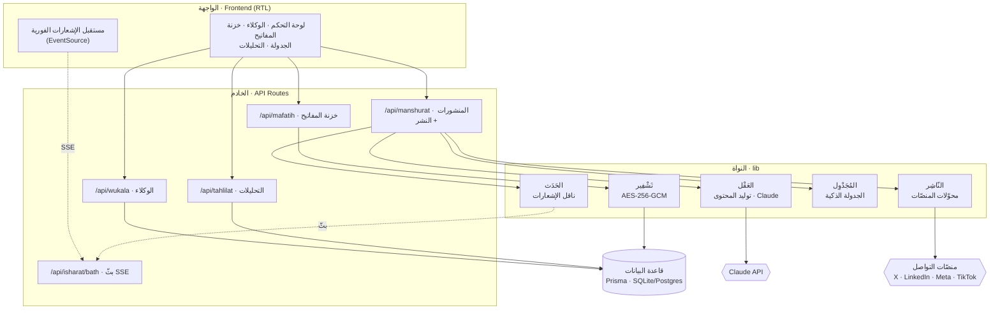
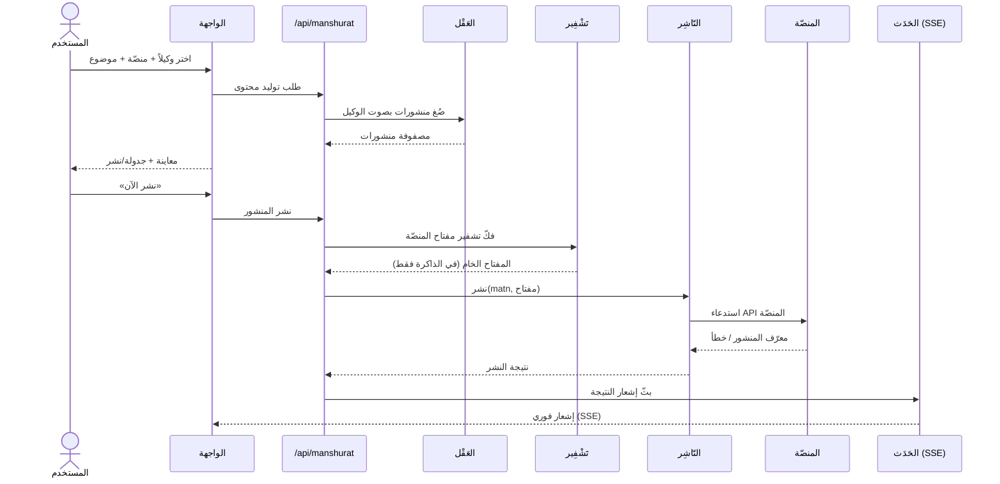
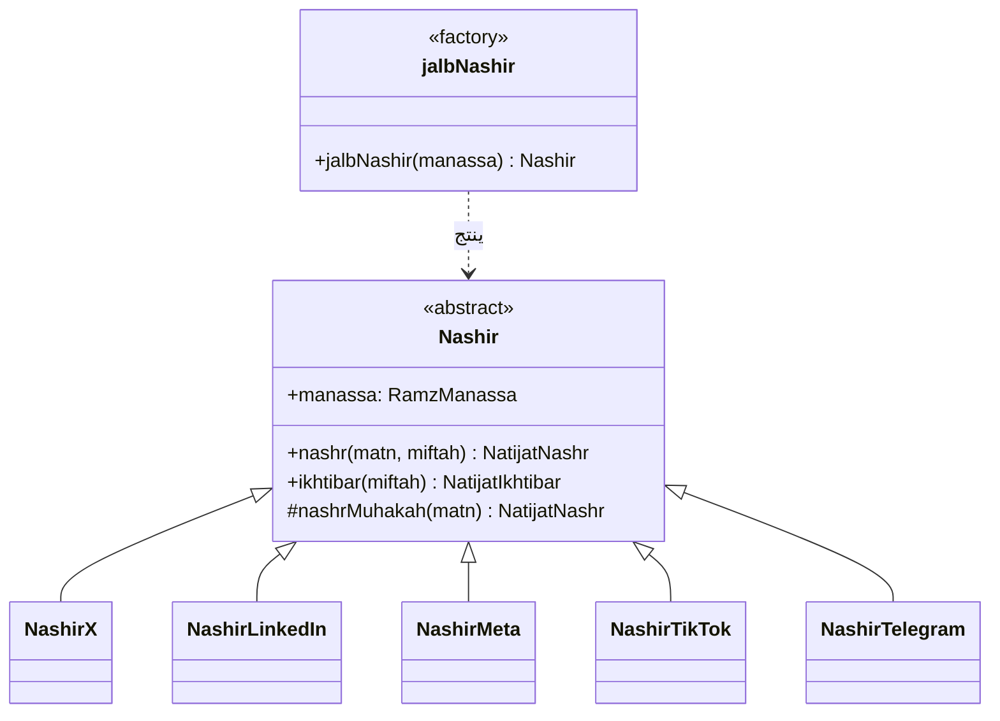

<div align="center">

# صَدَى · Sada

### منصّة وكلاء الذكاء الاصطناعي للنشر التلقائي الذكي

*صوتك يتردّد عبر كل المنصّات.*

`Next.js 14` · `TypeScript` · `Prisma` · `Tailwind (RTL)` · `Claude (Anthropic)`

</div>

---

## ✦ الفلسفة

> الصدى هو الصوت حين يتحرّر من صاحبه ويسافر.

في عالمٍ يطلب منك الحضور في كل مكان وفي كل لحظة، تولد **صَدَى** من فكرة بسيطة:
لا ينبغي أن تستنزفك المنصّات — بل أن تخدمك.

كل مستخدم في صَدَى لا ينشر بنفسه، بل **يخلق وكلاء**. كل وكيل كائن رقمي مستقلّ له:

- **شخصية** — نبرة، أسلوب، لغة، وحضور خاص.
- **تخصّص** — مجال يتقنه ويكتب فيه بعمق.
- **منصّات** — حيث يُطلق صداه (X، لينكدإن، إنستغرام، فيسبوك، تيك توك، **تيليغرام**).
- **عقل** — مدعوم بأحدث نماذج Claude، يصوغ المحتوى بصوت الوكيل لا بصوت آلة.

ثم يتولّى النظام الباقي: **جدولة ذكية** في أوقات الذروة، **نشر تلقائي**، و**تحليل أداء** يُغذّي القرار التالي. أنت تضع الرؤية؛ وكلاؤك يحملون الصدى.

ثلاثة مبادئ تحكم كل سطر هنا:

| المبدأ | التجسيد |
|---|---|
| **الأمان أولاً** | كل مفتاح API يُشفّر بـ `AES-256-GCM`. لا تُكتب قيمة خام إلى القرص أبداً. |
| **التوسّع بالتصميم** | نمط المحوّل (Adapter) يجعل إضافة منصّة جديدة = ملفاً واحداً. |
| **الإبداع في التفاصيل** | كود موثّق بالعربية، بأسماء فنية ذات دلالة (العقل، الناشر، المجدول، الحدث). |

---

## 🏛 المعمارية

### مخطّط المكوّنات



### مخطّط تسلسل النشر التلقائي



### مخطّط الكيانات (ER)

```mermaid
erDiagram
  MUSTAKHDIM ||--o{ WAKEEL : "يملك"
  MUSTAKHDIM ||--o{ MIFTAH : "يخزّن"
  MUSTAKHDIM ||--o{ ISHAAR : "يستقبل"
  WAKEEL ||--o{ MANSHUR : "ينتج"
  MANSHUR ||--o| TAHLIL : "يُقاس بـ"

  MUSTAKHDIM { string id PK; string email; string ism }
  WAKEEL { string id PK; string ism; string shakhsiyya; string manassat; string hala }
  MIFTAH { string id PK; string manassa; string qimaMushaffara; string basma }
  MANSHUR { string id PK; string manassa; string matn; string hala; datetime mawiidNashr }
  TAHLIL { string id PK; int mushahadat; int i3jabat; float mu3addalTafa3ul }
  ISHAAR { string id PK; string naw3; string unwan; bool maqru }
```

### مخطّط أصناف الناشرين (نمط المحوّل)



---

## 🗂 بنية المشروع

```
صَدَى/
├── prisma/
│   ├── schema.prisma        # مخطّط البيانات
│   └── seed.ts              # بيانات تجريبية
├── src/
│   ├── app/
│   │   ├── layout.tsx       # الجذر (RTL + خطوط عربية)
│   │   ├── page.tsx         # لوحة التحكم
│   │   ├── khazna/          # خزنة المفاتيح
│   │   ├── wukala/          # الوكلاء + معالج الإنشاء
│   │   ├── jadwala/         # الجدولة والنشر
│   │   ├── telegram/        # ✈ إدارة قناة تيليغرام
│   │   ├── tahlilat/        # التحليلات (رسوم)
│   │   └── api/             # واجهات الخادم (+ /api/telegram)
│   ├── components/
│   │   └── Shell.tsx        # الهيكل + الإشعارات الفورية
│   └── lib/
│       ├── tashfeer.ts      # 🔐 التشفير AES-256-GCM
│       ├── aql/             # 🧠 العقل (توليد المحتوى)
│       ├── nashir/          # 📡 الناشرون (محوّلات المنصّات + تيليغرام)
│       ├── telegram/        # ✈ عميل بوت تيليغرام + إدارة القناة
│       ├── mujadwil/        # 🗓 الجدولة الذكية
│       ├── hadath/          # 🔔 ناقل الإشعارات (SSE)
│       └── types.ts         # الأنواع والثوابت
└── README.md
```

---

## 🚀 التشغيل

```bash
# 1) التبعيات
npm install

# 2) البيئة — انسخ المثال واملأ القيم
cp .env.example .env

#    وَلِّد مفتاح التشفير الرئيسي:
node -e "console.log(require('crypto').randomBytes(32).toString('base64'))"
#    ضع الناتج في SADA_MASTER_KEY داخل .env
#    وأضِف ANTHROPIC_API_KEY لتفعيل العقل.

# 3) قاعدة البيانات + بيانات تجريبية
npm run db:push
npm run db:seed

# 4) الإطلاق
npm run dev      # http://localhost:3000
```

> 💡 **وضع المحاكاة:** للتجربة دون مفاتيح منصّات حقيقية، ضع `SADA_NASHR_MUHAKAH=1`
> في `.env` — يحاكي النظام النشر الناجح على كل المنصّات.

---

## 🔐 ملاحظات أمنية

- **التشفير:** `AES-256-GCM` (تشفير مُصادَق) — يضمن السرّية وسلامة البيانات معاً. لكل مفتاح متّجه تهيئة (IV) فريد.
- **عدم الكشف:** واجهة `/api/mafatih` لا تُرجِع القيمة المشفّرة أبداً — فقط آخر 4 أحرف للتمييز.
- **المفتاح الرئيسي:** يُقرأ من البيئة فقط (`SADA_MASTER_KEY`). لا تُودِعه في الكود أو الـ Git.
- **مراقبة الاستخدام:** كل مفتاح يسجّل عدّاد استخدام وآخر استخدام (أساس لتدوير المفاتيح).

---

## 🧭 خارطة التوسعة

- [ ] طبقة مصادقة حقيقية (NextAuth) بدل المستخدم التجريبي.
- [ ] مُشغّل خلفي (cron) ينفّذ النشر المجدول تلقائياً.
- [ ] تدفّق OAuth كامل لكل منصّة بدل الرموز اليدوية.
- [ ] طبقة تعلّم تشتقّ أوقات الذروة من بيانات التفاعل الفعلية لكل وكيل.
- [ ] ترقية الإشعارات من SSE إلى WebSocket ثنائي الاتجاه.

---

<div align="center">

صُنع بشغف · **صَدَى**

</div>
